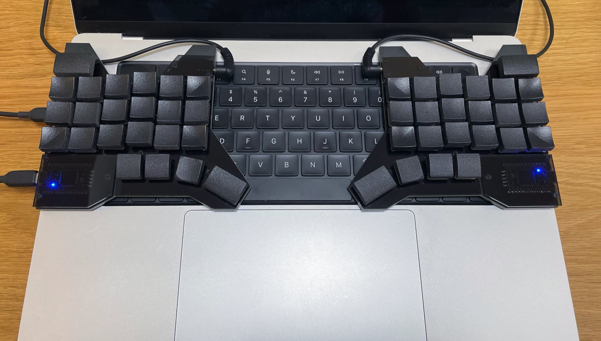

# escd-diodeless keyboard

The "escd-diodeless" keyboard is a thin split keyboard with 3x6 column staggered keys, 4 thumb keys, and one big escape key (46 keys total). There are no LEDs or diodes, only for CHERRY MX Low Profile switches and Elite-C controllers.

"escd" is pronounced as "escaped.”

## Design




## Directories

```text
├── doc
│   └── image
├── escd-diodeless
│   ├── firmware   ... The firmware.
│   ├── garbar     ... Garbar files For 3D printing.
│   ├── pcb        ... KiCad files for PCB.
│   └── plate      ... Inkscape files for acrylic plates.
├── keycap         ... FreeCad files for keycaps.
├── layout         ... "keyboard-layout-editor" file.
└── qmk-keyboards
    └── escd       ... The source of the firmware.
```

### Layout


### PCB

The PCB is designed reversible. The thickness is 1.6mm.

23 pins of the Elite-C controller are directly connected to switches. This is why the keyboard doesn’t need diodes.
Almost all Elite-C pins are used but a reset pin because it has a tiny reset button.

<https://deskthority.net/wiki/Elite-C#Version_4.0>

### Plates

The thickness of the acrylic plates is 2.0mm.

There are 4 types of acrylic plates. Top, bottom, and 2 little cover plates.
The bottom plates need an M2 tap work for sandwich PCB.

### Keycaps

There are 6 types of 1u (Center, CenterHome, Side, Corner, Thumb, ThumbHome) and 2 types of 1.5u (ESC, Space) keycaps designed for CHERRY MX Low Profile.

I recommend 3D printing by MJF PA11 without polishing and applying a matte clear coat on the top surface.

### Firmware

Use QMK Toolbox to install the firmware (`escd-diodeless/firmware/escd_diodeless_default.hex`) to Elite-C controllers.

`qmk-keyboards/escd` directory is for qmk_firmware. Symlink or copy the directory to the `qmk_firmware/keyboards` directory and modify [keymaps](qmk-keyboards/escd/diodeless/keymaps/default/keymap.c) if you want.

## Build guide

### Parts

- Elice-C controller x 2
- CHERRY MX Low Profile switches x 46
- TRRS jack x 2
- M2x6mm screw x 10
- M2x5mm screw x 6
- M2x3mm screw x 18
- M2x3mm spacer x 6
- M2x5mm spacer x 6
- Rubber foot x 8

- TRRS cable x 1
- Type-C USB cable x 1

### Special tool

- M2 tap

### Build steps

1. Cut the switch and TRRS jack pins so they don't protrude from the PCB.
  
2. Solder switches, TRRS jacks, and Elite-C controllers.
  
3. Install firmware and test the keyboard to make sure it works.  
  Connect the keyboard to a PC with a Type-C cable and install the firmware.  
  Connect both sides with a TRRS cable, and connect the left keyboard to the PC with the Type-C cable. Then test all keys on the keyboard.
4. Tap in the bottom plates.
  
5. Put the bottom plates and covers.
  
6. Put rubber feet.
  

## License

See the [LICENSE](LICENSE.txt) file for license rights and limitations (MIT).
